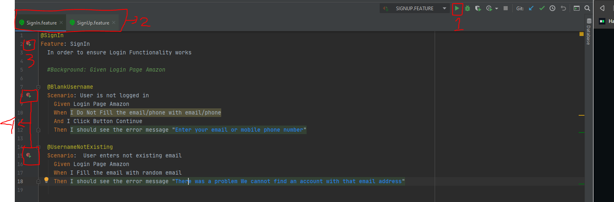

## Amazon-SignIn_SignUp
Create Automation For Test SignIn and SignUp
To Learn About Structure Cucumber and Ruby

## File or Application needed
* [Visual Studio Code](https://code.visualstudio.com/) - Editor
* [Chocolatey](https://chocolatey.org/) - Package Manager
* [Ruby](https://rubyinstaller.org/downloads/) - Language For Logic
* [ChromeDriver](https://chromedriver.chromium.org/downloads) - Browser Driver
* [RubyMine](https://www.jetbrains.com/ruby/) - IDE

## Structure Tree
```bash
├── Gemfile
├── Gemfile.lock
└── features
    ├── signIn.feature
    ├── signUp.feature
    ├── support 
    │   └── env.rb
    └── step_definitions
        ├── signIn_step.rb
        └── signUp_step.rb
```

## How To Use
Cloning
```
git clone https://github.com/PwS/Amazon_SignIn_SignUp.git
cd Amazon_SignIn_SignUp
```

Install bundler
```
gem install bundler
```

Install dependencies Project
```
bundle install
```
Running
```
bundle exec cucumber
```

If Using Ide RubyMine , The IDE Have separated Button to Running each Feature / Scenario
1. Run Feature (Shortcut Shift + F10)
2. Opened Class (Run on Each Class/File to Check specific feature)
3. Run Feature (On Spesific Class/File)
4. Run Spesific Scenario

