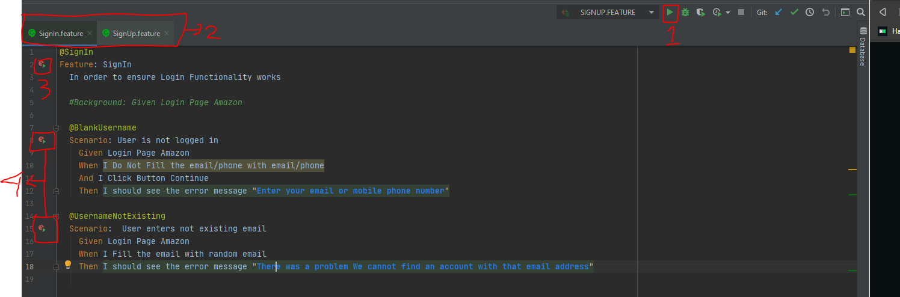

# Amazon Sign In / Sign Up – UI Test Automation

[](https://github.com/PwS/Amazon_SignIn_SignUp/actions/workflows/ci.yml)

A small learning project for **Cucumber + Ruby** browser tests. It checks the
validation messages on Amazon's **Sign In** and **Create Account** pages.
It follows common test-automation best practices:

- **Page Object Model**: selectors live only in page classes, and steps read like plain English.
- **No hard-coded `sleep`**: Capybara waits for elements and text to appear.
- **Real assertions**: every `Then` step checks what is on the page.
- **Config through environment variables**: browser, headless mode, base URL and timeouts.
- **Automatic driver management**: Selenium Manager downloads the right ChromeDriver/GeckoDriver.
- **Reports**: HTML and JUnit reports, with a screenshot attached for each failed scenario.
- **Linting and CI**: RuboCop and a Cucumber dry run on every push and pull request.

## Tech stack

| Tool | Purpose |
| --- | --- |
| [Ruby](https://www.ruby-lang.org/) 3.1+ | Language |
| [Cucumber](https://cucumber.io/) | BDD test runner (Gherkin) |
| [Capybara](https://github.com/teamcapybara/capybara) | Browser interaction and auto-waiting |
| [Selenium WebDriver](https://www.selenium.dev/) | Drives Chrome / Firefox |
| [RSpec Expectations](https://rspec.info/) | Assertions |
| [Faker](https://github.com/faker-ruby/faker) | Random test data |
| [RuboCop](https://rubocop.org/) | Code style / linting |

## Project structure

```text
.
├── .github/
│   ├── workflows/ci.yml           # Lint + dry run on every push / PR
│   └── dependabot.yml             # Weekly dependency updates
├── features/
│   ├── sign_in.feature            # Sign-in scenarios
│   ├── sign_up.feature            # Sign-up scenarios
│   ├── step_definitions/
│   │   ├── common_steps.rb        # Steps shared by all features
│   │   ├── sign_in_steps.rb
│   │   └── sign_up_steps.rb
│   └── support/
│       ├── env.rb                 # Capybara setup (loaded first)
│       ├── config.rb              # Settings read from ENV
│       ├── driver.rb              # Browser driver registration
│       ├── hooks.rb               # Screenshot on failure
│       ├── world.rb               # Page object helpers for steps
│       └── pages/                 # Page Object Model
│           ├── base_page.rb
│           ├── home_page.rb
│           ├── sign_in_page.rb
│           └── sign_up_page.rb
├── cucumber.yml                   # Run profiles (default, headless, ci)
├── Rakefile                       # Shortcut tasks
├── .rubocop.yml
├── Gemfile / Gemfile.lock
└── .ruby-version
```

## Getting started

### Prerequisites

- Ruby 3.1 or newer ([RubyInstaller](https://rubyinstaller.org/downloads/) on Windows, `rbenv`/`asdf` on macOS/Linux)
- Google Chrome (or Firefox)

You no longer need to install ChromeDriver yourself. Selenium Manager downloads it on the first run.

### Install

```bash
git clone https://github.com/PwS/Amazon_SignIn_SignUp.git
cd Amazon_SignIn_SignUp
gem install bundler
bundle install
```

## Running the tests

```bash
bundle exec cucumber                      # all scenarios, visible browser
bundle exec cucumber -p headless          # all scenarios, headless browser
bundle exec cucumber --tags @sign_in      # only one feature
bundle exec cucumber --tags @blank_email  # only one scenario
bundle exec cucumber features/sign_up.feature:11   # scenario on a given line
```

Or with Rake:

| Command | What it does |
| --- | --- |
| `bundle exec rake` | Lint + dry run (the same checks CI runs) |
| `bundle exec rake test:all` | Run every scenario |
| `bundle exec rake test:sign_in` | Run the sign-in scenarios |
| `bundle exec rake test:sign_up` | Run the sign-up scenarios |
| `bundle exec rake test:dry_run` | Check every step has a definition, without opening a browser |
| `bundle exec rake lint` | Run RuboCop |

### Configuration

All settings have sensible defaults and can be overridden with environment variables:

| Variable | Default | Description |
| --- | --- | --- |
| `BROWSER` | `chrome` | `chrome` or `firefox` |
| `HEADLESS` | `false` | `true` to run without a visible window |
| `BASE_URL` | `https://www.amazon.com` | Site under test (e.g. `https://www.amazon.co.uk`) |
| `WAIT_TIME` | `10` | Seconds Capybara waits for elements and text |
| `WINDOW_SIZE` | `1366,780` | Browser window size |
| `CHROME_BINARY` | – | Path to a custom Chrome/Chromium binary |
| `CHROME_ARGS` | – | Extra Chrome flags, e.g. `--no-sandbox --disable-dev-shm-usage` in Docker |

Example:

```bash
BROWSER=firefox HEADLESS=true bundle exec cucumber
```

On Windows PowerShell: `$env:HEADLESS="true"; bundle exec cucumber`

### Reports

Each run writes its results to `reports/`:

- `reports/cucumber.html`: an HTML report you can open in a browser, with screenshots of failed scenarios
- `reports/junit/`: JUnit XML files for CI tools
- `reports/screenshots/`: screenshots of failed scenarios

## Adding a new test

1. **Write the scenario** in a `.feature` file in business language, and add a tag such as `@my_scenario`.
2. **Add or reuse page object methods** in `features/support/pages/`. Keep every selector in a
   constant at the top of the page class.
3. **Write the step definition** in `features/step_definitions/`. Steps should call page objects
   only, never `find('#some-id')` directly.
4. Run `bundle exec rake` to lint and check that every step is defined, then run the scenario.

Example:

```ruby
# features/support/pages/sign_in_page.rb
class SignInPage < BasePage
  PASSWORD_FIELD = '#ap_password'

  def enter_password(password)
    fill(PASSWORD_FIELD, password)
    self
  end
end

# features/step_definitions/sign_in_steps.rb
When('I enter the password {string}') do |password|
  sign_in_page.enter_password(password)
end
```

### Conventions

- File names are `snake_case`, and tags are `@snake_case`.
- Use `Background` for steps that every scenario in a feature repeats.
- Use `Scenario Outline` + `Examples` for the same flow with different data.
- Never use `sleep`. Use Capybara matchers (`have_text`, `have_css`) because they wait automatically.
- Don't hard-code real credentials. Use environment variables or Faker.

## Running from RubyMine

RubyMine has a run button next to every Feature and Scenario:

1. Run all features (shortcut `Shift + F10`)
2. Open a feature file
3. Run a single feature
4. Run a single scenario



## Notes and limitations

- These tests run against the **live Amazon website**. Amazon can change its page layout, error
  wording or sign-in flow at any time, and it may show a CAPTCHA to automated browsers. If a test
  starts failing, first check the screenshot in the report and update the selector or message in
  the page object or feature file.
- For the same reason, CI only runs lint and a dry run, not the live browser tests.
- This project is for learning. Never automate real account creation on Amazon.
